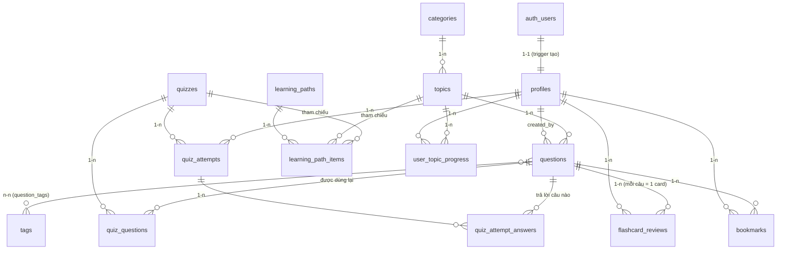

> Tài liệu này thuộc bộ kế hoạch **FE Interview Prep**. Xem tổng quan tại [00-MASTER-PLAN.md](./00-MASTER-PLAN.md).
>
> ⚠️ **ĐÃ CHUẨN HOÁ SAU RECONCILE GATE.** Schema chính thức (nguồn chân lý DB + TypeScript types) nằm ở [08-RECONCILED-SCHEMA.md](./08-RECONCILED-SCHEMA.md). File này giữ phần giải thích Supabase/RLS/kết nối cho người mới để tham khảo; khi có khác biệt về **schema**, **08 thắng**.

# Thiết kế Data Model trên Supabase — "FE Interview Prep"

> Tài liệu này dành cho người **lần đầu dùng Supabase**. Mỗi phần đều có giải thích khái niệm trước, rồi mới đến SQL thật (copy-paste được để làm migration). Các bước bạn phải tự làm trên dashboard được đánh dấu **⚠️ THỦ CÔNG**.

Supabase về bản chất là một **PostgreSQL database** được gói kèm sẵn Auth, Storage, API tự sinh và Row Level Security (RLS). Nghĩa là mọi thứ bên dưới chỉ là Postgres chuẩn — kỹ năng bạn học ở đây dùng được cho bất kỳ Postgres nào.

---

## 0. Tổng quan sơ đồ quan hệ (ERD)



**Phân nhóm bảng theo mục đích** (quan trọng vì quyết định chính sách RLS):

| Nhóm | Bảng | Ai được đọc | Ai được ghi |
|------|------|-------------|-------------|
| **Nội dung học** (public) | `categories`, `topics`, `questions`, `tags`, `question_tags`, `quizzes`, `quiz_questions`, `learning_paths`, `learning_path_items` | Mọi người (bản `is_published`) | Chỉ **admin** |
| **Dữ liệu cá nhân** (private) | `bookmarks`, `quiz_attempts`, `quiz_attempt_answers`, `flashcard_reviews`, `user_topic_progress` | Chỉ **chính chủ** (+admin để thống kê) | Chỉ **chính chủ** |
| **Danh tính** | `profiles` | Chính chủ + admin | Chính chủ (trừ cột `role`) |

---

## 1. Quyết định nền tảng: Xử lý song ngữ Việt–Anh trong DB

Đây là quyết định phải chốt **trước** khi thiết kế bảng, vì nó ảnh hưởng đến toàn bộ cột.

### So sánh 3 phương án

| Tiêu chí | (a) Cột riêng `_vi` / `_en` cùng bảng | (b) Bảng `*_translations` riêng | (c) Cột `jsonb {vi, en}` |
|---|---|---|---|
| **Ví dụ** | `question_vi text`, `question_en text` | `question_translations(question_id, locale, text)` | `question jsonb = {"vi":"...","en":"..."}` |
| **Type-safety (TS strict)** | ⭐ Tuyệt vời — sinh ra `question_vi: string; question_en: string` | Trung bình — phải join & map | Kém — sinh ra `question: Json`, phải cast tay |
| **Query / đọc** | ⭐ Không cần join, chọn cột theo `locale` ở app | Cần join hoặc filter `locale` mỗi lần | Đọc `->>'vi'` trong SQL |
| **Full-text search theo ngôn ngữ** | ⭐ Dễ: `tsvector` riêng mỗi cột (config `simple` cho vi, `english` cho en) | Được nhưng phải index theo `locale` | Làm được bằng expression index nhưng rối |
| **Ràng buộc NOT NULL cho từng ngôn ngữ** | ⭐ `question_vi text not null` | Khó — có thể thiếu bản dịch | Không ép được ở DB |
| **Thêm ngôn ngữ thứ 3** | Phải `ALTER TABLE` thêm cột | ⭐ Chỉ thêm row, không đổi schema | ⭐ Chỉ thêm key |
| **Seed & sửa ở trang Admin** | ⭐ 1 form, 1 row | Phải quản 2 row/bản ghi | 1 row nhưng edit JSON dễ sai |

### ✅ Đề xuất: **Phương án (a) — cột riêng `_vi` / `_en`**

**Lý do cho đúng dự án này:**

1. **Chỉ có đúng 2 ngôn ngữ cố định** và **luôn cần cả hai** (song ngữ là yêu cầu bắt buộc). Điểm yếu duy nhất của (a) — khó thêm ngôn ngữ — gần như không xảy ra. Nếu sau này thật sự cần ngôn ngữ thứ 3, một lần `ALTER TABLE ADD COLUMN` là chuyện nhỏ.
2. **Type-safety tuyệt đối** là yêu cầu cứng của dự án. `supabase gen types` sẽ sinh ra `string` rõ ràng cho từng ngôn ngữ — không cần cast, không `any`, không `as`.
3. **Full-text search** (tính năng search trong ngân hàng câu hỏi) làm sạch nhất với generated `tsvector` cho từng cột ngôn ngữ.
4. **RLS đơn giản** — không phát sinh bảng join phụ cần thêm policy.
5. **User là người HỌC** — họ chỉ đọc; nội dung do admin seed/nhập một lần. Không có bài toán dịch động phức tạp cần bảng translation.

> **Ngoại lệ hợp lý — vẫn dùng `jsonb`, nhưng cho dữ liệu KHÔNG phải bản dịch text**: ví dụ `options` của câu trắc nghiệm (mảng lựa chọn), `reference_links` (mảng link). Đây là dữ liệu bán cấu trúc, không phải "song ngữ 2 nhánh", nên `jsonb` là đúng chỗ. Bên trong option vẫn có `text_vi`/`text_en`.

**Quy ước đặt tên áp dụng toàn dự án:** mọi text hiển thị cho người dùng đều có cặp `<field>_vi` và `<field>_en`. Ở tầng app, một helper thuần `pickLocale(row, field, locale)` (đặt trong `src/helpers/`, KHÔNG chứa React) sẽ chọn đúng cột.

---

## 2. Custom types (ENUM)

Nên nằm ở migration **đầu tiên** vì các bảng phụ thuộc vào chúng.

```sql
-- supabase/migrations/0001_types.sql

create type public.user_role       as enum ('user', 'admin');
create type public.difficulty_level as enum ('junior', 'mid', 'senior');
create type public.question_type   as enum ('single_choice', 'multiple_choice', 'true_false', 'open_ended');
create type public.attempt_status  as enum ('in_progress', 'completed', 'abandoned');
create type public.progress_status as enum ('not_started', 'in_progress', 'completed');
create type public.path_item_type  as enum ('topic', 'quiz', 'question');
```

> Ở app, các giá trị này nên được khai báo lại thành **constants** trong `src/constants/` (ví dụ `DIFFICULTY_LEVELS`) để tránh hardcode chuỗi rải rác. `supabase gen types` cũng sẽ sinh union type (`'junior' | 'mid' | 'senior'`) cho bạn.

**Hàm dùng chung** (đặt ở migration functions, dùng cho `updated_at`):

```sql
-- Tự cập nhật updated_at mỗi lần UPDATE
create or replace function public.set_updated_at()
returns trigger
language plpgsql
as $$
begin
  new.updated_at = now();
  return new;
end;
$$;
```

---

## 3. Schema chi tiết từng bảng

> `CREATE TABLE` bên dưới đã tự mô tả **cột / kiểu / PK / FK / default / constraint**. Sau mỗi bảng mình liệt kê thêm **index**, **quan hệ**, và **ghi chú cột đặc biệt**.

### 3.1 `profiles` — mở rộng `auth.users`

Supabase quản lý bảng `auth.users` (email, password hash, provider...). Ta **không** đụng vào bảng đó; thay vào đó tạo `profiles` với `id` trỏ 1-1 sang `auth.users.id`. Đây là nơi lưu `role`, tên hiển thị, avatar...

```sql
create table public.profiles (
  id          uuid primary key references auth.users(id) on delete cascade,
  email       text,
  full_name   text,
  avatar_url  text,
  role        public.user_role not null default 'user',
  locale      text not null default 'vi',       -- ngôn ngữ UI ưa thích
  created_at  timestamptz not null default now(),
  updated_at  timestamptz not null default now()
);

create trigger trg_profiles_updated_at
  before update on public.profiles
  for each row execute function public.set_updated_at();
```

- **PK:** `id` (đồng thời là FK → `auth.users.id`, `on delete cascade` → xóa user thì xóa profile).
- **Quan hệ:** 1-1 với `auth.users`; 1-n với hầu hết bảng cá nhân (`user_id`).
- **Ghi chú:** cột `role` là "nguồn sự thật" để phân biệt admin. **Không cho user tự sửa cột này** (xem RLS §5).

---

### 3.2 `categories` — chủ đề lớn (JavaScript, React, CSS, TypeScript, System Design FE...)

```sql
create table public.categories (
  id             uuid primary key default gen_random_uuid(),
  slug           text not null unique,            -- 'javascript', 'react' — dùng cho URL
  name_vi        text not null,
  name_en        text not null,
  description_vi text,
  description_en text,
  icon           text,                            -- tên icon (lucide) hoặc emoji
  color          text,                            -- token màu cho UI
  sort_order     int  not null default 0,
  is_published   boolean not null default true,
  created_at     timestamptz not null default now(),
  updated_at     timestamptz not null default now()
);

create index idx_categories_sort on public.categories (sort_order);

create trigger trg_categories_updated_at
  before update on public.categories
  for each row execute function public.set_updated_at();
```

- **Index:** `slug` (unique, auto), `sort_order`.
- **Quan hệ:** 1-n → `topics`.

---

### 3.3 `topics` — chủ đề con (Closures, Hoisting, Event Loop, Hooks, Reconciliation...)

```sql
create table public.topics (
  id             uuid primary key default gen_random_uuid(),
  category_id    uuid not null references public.categories(id) on delete cascade,
  slug           text not null unique,
  name_vi        text not null,
  name_en        text not null,
  description_vi text,
  description_en text,
  difficulty     public.difficulty_level not null default 'junior',
  sort_order     int  not null default 0,
  is_published   boolean not null default true,
  created_at     timestamptz not null default now(),
  updated_at     timestamptz not null default now()
);

create index idx_topics_category on public.topics (category_id);
create index idx_topics_published on public.topics (is_published);

create trigger trg_topics_updated_at
  before update on public.topics
  for each row execute function public.set_updated_at();
```

- **Index quan trọng:** `category_id` (FK — luôn nên index FK để join/filter nhanh).
- **Quan hệ:** n-1 → `categories`; 1-n → `questions`.

---

### 3.4 `questions` — ngân hàng câu hỏi + đáp án chi tiết (dùng lại cho cả Quiz & Flashcard)

Đây là bảng trung tâm. Một `question` vừa là **thẻ Q&A** (có `answer_vi/en` giải thích chi tiết), vừa có thể là **câu trắc nghiệm** (có `options` + `correct_keys`), vừa là **flashcard**. Nhờ vậy ta tái sử dụng nội dung thay vì nhân bản.

```sql
create table public.questions (
  id             uuid primary key default gen_random_uuid(),
  topic_id       uuid not null references public.topics(id) on delete cascade,
  slug           text unique,
  type           public.question_type not null default 'open_ended',
  difficulty     public.difficulty_level not null default 'junior',

  -- Nội dung song ngữ (phương án (a))
  question_vi    text not null,
  question_en    text not null,
  answer_vi      text not null,        -- giải thích chi tiết (markdown)
  answer_en      text not null,

  -- Trắc nghiệm (jsonb đúng chỗ: dữ liệu bán cấu trúc)
  options        jsonb,                -- [{"key":"a","text_vi":"...","text_en":"..."}, ...]
  correct_keys   text[],              -- ['a'] hoặc ['a','c'] cho multiple_choice

  -- Bổ trợ
  code_snippet   text,                 -- ví dụ code (nếu có)
  code_language  text default 'javascript',
  reference_links jsonb,               -- [{"label":"MDN","url":"https://..."}]

  is_published   boolean not null default true,
  created_by     uuid references public.profiles(id) on delete set null,
  created_at     timestamptz not null default now(),
  updated_at     timestamptz not null default now(),

  -- Full-text search: sinh tự động, không cần app tính
  search_vi tsvector generated always as (
    to_tsvector('simple',  coalesce(question_vi,'') || ' ' || coalesce(answer_vi,''))
  ) stored,
  search_en tsvector generated always as (
    to_tsvector('english', coalesce(question_en,'') || ' ' || coalesce(answer_en,''))
  ) stored,

  -- Nếu là trắc nghiệm thì phải có options & đáp án đúng
  constraint chk_mcq_has_options check (
    type = 'open_ended' or (options is not null and correct_keys is not null)
  )
);

create index idx_questions_topic       on public.questions (topic_id);
create index idx_questions_difficulty  on public.questions (difficulty);
create index idx_questions_published   on public.questions (is_published);
create index idx_questions_search_vi   on public.questions using gin (search_vi);
create index idx_questions_search_en   on public.questions using gin (search_en);

create trigger trg_questions_updated_at
  before update on public.questions
  for each row execute function public.set_updated_at();
```

- **Index quan trọng:** FK `topic_id`; filter `difficulty`, `is_published`; **GIN** trên `search_vi`/`search_en` cho tính năng search.
- **Quan hệ:** n-1 → `topics`; n-n → `tags`; 1-n → `quiz_questions`, `flashcard_reviews`, `bookmarks`, `quiz_attempt_answers`.
- **Ghi chú:** dùng config `'simple'` cho tiếng Việt vì Postgres không có dictionary tiếng Việt sẵn (`simple` vẫn tách token + bỏ hoa/thường tốt); `'english'` cho tiếng Anh để có stemming.

**Ví dụ query search (dùng trong custom hook `useQuestionSearch`):**

```sql
select * from public.questions
where is_published = true
  and search_vi @@ websearch_to_tsquery('simple', $1)   -- $1 = từ khóa người dùng gõ
order by ts_rank(search_vi, websearch_to_tsquery('simple', $1)) desc;
```

---

### 3.5 `tags` + `question_tags` — gắn nhãn (n-n)

```sql
create table public.tags (
  id       uuid primary key default gen_random_uuid(),
  slug     text not null unique,        -- 'async', 'performance', 'es6'
  name_vi  text not null,
  name_en  text not null,
  created_at timestamptz not null default now()
);

create table public.question_tags (
  question_id uuid not null references public.questions(id) on delete cascade,
  tag_id      uuid not null references public.tags(id)      on delete cascade,
  primary key (question_id, tag_id)      -- PK phức hợp = tránh trùng cặp
);

create index idx_question_tags_tag on public.question_tags (tag_id);
```

- **PK:** phức hợp `(question_id, tag_id)` — bản chất của bảng join n-n.
- **Index:** thêm `tag_id` (chiều còn lại; chiều `question_id` đã có nhờ PK bắt đầu bằng nó).
- **Quan hệ:** `question_tags` là **junction** giữa `questions` và `tags`.

---

### 3.6 `quizzes` + `quiz_questions` — bộ đề trắc nghiệm

`quizzes` = một bộ đề (metadata). `quiz_questions` = bảng join chọn câu nào từ ngân hàng vào đề nào, kèm thứ tự và điểm.

```sql
create table public.quizzes (
  id             uuid primary key default gen_random_uuid(),
  slug           text not null unique,
  category_id    uuid references public.categories(id) on delete set null,
  title_vi       text not null,
  title_en       text not null,
  description_vi text,
  description_en text,
  difficulty     public.difficulty_level not null default 'junior',
  time_limit_sec int,                    -- null = không giới hạn thời gian
  pass_score     int not null default 70, -- % để đạt
  is_published   boolean not null default true,
  created_by     uuid references public.profiles(id) on delete set null,
  created_at     timestamptz not null default now(),
  updated_at     timestamptz not null default now()
);

create table public.quiz_questions (
  id          uuid primary key default gen_random_uuid(),
  quiz_id     uuid not null references public.quizzes(id)   on delete cascade,
  question_id uuid not null references public.questions(id) on delete cascade,
  sort_order  int  not null default 0,
  points      int  not null default 1,
  unique (quiz_id, question_id)          -- 1 câu chỉ xuất hiện 1 lần trong 1 đề
);

create index idx_quiz_questions_quiz on public.quiz_questions (quiz_id);

create trigger trg_quizzes_updated_at
  before update on public.quizzes
  for each row execute function public.set_updated_at();
```

- **Quan hệ:** `quizzes` 1-n `quiz_questions`; `quiz_questions` n-1 `questions` (tái sử dụng ngân hàng).
- **Index:** FK `quiz_id`; `unique(quiz_id, question_id)` vừa đảm bảo không trùng vừa là index.

---

### 3.7 `quiz_attempts` + `quiz_attempt_answers` — lượt làm bài & chấm điểm

```sql
create table public.quiz_attempts (
  id              uuid primary key default gen_random_uuid(),
  user_id         uuid not null references public.profiles(id) on delete cascade,
  quiz_id         uuid not null references public.quizzes(id)  on delete cascade,
  status          public.attempt_status not null default 'in_progress',
  score           numeric(5,2),          -- % điểm, null khi chưa nộp
  correct_count   int,
  total_questions int,
  duration_sec    int,
  started_at      timestamptz not null default now(),
  completed_at    timestamptz
);

create index idx_quiz_attempts_user on public.quiz_attempts (user_id);
create index idx_quiz_attempts_quiz on public.quiz_attempts (quiz_id);

create table public.quiz_attempt_answers (
  id            uuid primary key default gen_random_uuid(),
  attempt_id    uuid not null references public.quiz_attempts(id) on delete cascade,
  user_id       uuid not null references public.profiles(id) on delete cascade, -- denormalize cho RLS nhanh
  question_id   uuid not null references public.questions(id) on delete cascade,
  selected_keys text[] not null default '{}',
  is_correct    boolean,
  answered_at   timestamptz not null default now(),
  unique (attempt_id, question_id)
);

create index idx_attempt_answers_attempt on public.quiz_attempt_answers (attempt_id);
create index idx_attempt_answers_user    on public.quiz_attempt_answers (user_id);
```

- **Quan hệ:** `quiz_attempts` 1-n `quiz_attempt_answers`.
- **Ghi chú quan trọng — vì sao có `user_id` trên `quiz_attempt_answers`:** RLS cần kiểm tra "row này của ai". Nếu không lưu `user_id` trực tiếp, mỗi policy phải subquery ngược lên `quiz_attempts` → chậm và rối. **Denormalize `user_id`** là pattern phổ biến của Supabase để RLS đơn giản và nhanh.

---

### 3.8 `flashcard_reviews` — trạng thái Spaced Repetition (thuật toán SM-2)

Mỗi cặp (user, question) có **một** row lưu tiến trình ôn tập ngắt quãng. Đây là dữ liệu cốt lõi của tính năng flashcard.

```sql
create table public.flashcard_reviews (
  id               uuid primary key default gen_random_uuid(),
  user_id          uuid not null references public.profiles(id) on delete cascade,
  question_id      uuid not null references public.questions(id) on delete cascade,

  -- Trạng thái SM-2
  ease_factor      numeric(4,2) not null default 2.50,  -- độ "dễ", khởi đầu 2.5
  interval_days    int  not null default 0,             -- khoảng cách lần ôn tiếp theo
  repetitions      int  not null default 0,             -- số lần trả lời đúng liên tiếp
  due_date         date not null default current_date,  -- ngày đến hạn ôn
  last_grade       int,                                 -- 0..5 (chất lượng nhớ lần cuối)
  lapses           int  not null default 0,             -- số lần quên (grade < 3)
  last_reviewed_at timestamptz,

  created_at       timestamptz not null default now(),
  updated_at       timestamptz not null default now(),

  unique (user_id, question_id)          -- 1 card / user / question
);

-- Index CỰC quan trọng: "lấy các card đến hạn hôm nay của tôi"
create index idx_flashcard_due on public.flashcard_reviews (user_id, due_date);

create trigger trg_flashcard_updated_at
  before update on public.flashcard_reviews
  for each row execute function public.set_updated_at();
```

- **Ghi chú:** `ease_factor`, `interval_days`, `repetitions`, `due_date` chính là 4 biến của thuật toán **SM-2**. Logic tính toán SM-2 nên đặt ở **helper thuần** `src/helpers/spacedRepetition.ts` (`computeNextReview(prevState, grade)` → trả về state mới) — hàm thuần, không React, dễ unit test. Custom hook `useFlashcardSession` gọi helper rồi upsert xuống bảng này.
- **Query lấy card đến hạn:**

```sql
select q.*
from public.flashcard_reviews r
join public.questions q on q.id = r.question_id
where r.user_id = auth.uid() and r.due_date <= current_date
order by r.due_date
limit 20;
```

---

### 3.9 `learning_paths` + `learning_path_items` — lộ trình junior → senior

```sql
create table public.learning_paths (
  id             uuid primary key default gen_random_uuid(),
  slug           text not null unique,
  title_vi       text not null,
  title_en       text not null,
  description_vi text,
  description_en text,
  target_level   public.difficulty_level not null default 'junior',
  sort_order     int  not null default 0,
  is_published   boolean not null default true,
  created_at     timestamptz not null default now(),
  updated_at     timestamptz not null default now()
);

create table public.learning_path_items (
  id          uuid primary key default gen_random_uuid(),
  path_id     uuid not null references public.learning_paths(id) on delete cascade,
  item_type   public.path_item_type not null,          -- 'topic' | 'quiz' | 'question'
  topic_id    uuid references public.topics(id)    on delete cascade,
  quiz_id     uuid references public.quizzes(id)   on delete cascade,
  question_id uuid references public.questions(id) on delete cascade,
  title_vi    text,                                     -- override nhãn hiển thị (optional)
  title_en    text,
  sort_order  int  not null default 0,
  is_optional boolean not null default false,

  -- Đảm bảo item_type khớp đúng cột được điền
  constraint chk_path_item_ref check (
    (item_type = 'topic'    and topic_id    is not null and quiz_id is null and question_id is null) or
    (item_type = 'quiz'     and quiz_id     is not null and topic_id is null and question_id is null) or
    (item_type = 'question' and question_id is not null and topic_id is null and quiz_id is null)
  )
);

create index idx_path_items_path on public.learning_path_items (path_id, sort_order);

create trigger trg_learning_paths_updated_at
  before update on public.learning_paths
  for each row execute function public.set_updated_at();
```

- **Quan hệ:** `learning_paths` 1-n `learning_path_items`; mỗi item trỏ tới **một** trong `topics`/`quizzes`/`questions` (polymorphic reference, được ép bằng `CHECK`).
- Đây là điểm mở rộng cho **Phase sau** (Coding challenge, Mock interview): chỉ cần thêm value vào enum `path_item_type` và cột FK tương ứng.

---

### 3.10 Dữ liệu cá nhân còn lại: `user_topic_progress`, `bookmarks`

```sql
create table public.user_topic_progress (
  id               uuid primary key default gen_random_uuid(),
  user_id          uuid not null references public.profiles(id) on delete cascade,
  topic_id         uuid not null references public.topics(id)   on delete cascade,
  status           public.progress_status not null default 'not_started',
  questions_total  int not null default 0,
  questions_studied int not null default 0,
  mastery_percent  numeric(5,2) not null default 0,
  last_activity_at timestamptz,
  completed_at     timestamptz,
  created_at       timestamptz not null default now(),
  updated_at       timestamptz not null default now(),
  unique (user_id, topic_id)
);

create index idx_topic_progress_user on public.user_topic_progress (user_id);

create trigger trg_topic_progress_updated_at
  before update on public.user_topic_progress
  for each row execute function public.set_updated_at();

create table public.bookmarks (
  id          uuid primary key default gen_random_uuid(),
  user_id     uuid not null references public.profiles(id)  on delete cascade,
  question_id uuid not null references public.questions(id) on delete cascade,
  note        text,
  created_at  timestamptz not null default now(),
  unique (user_id, question_id)          -- không bookmark trùng
);

create index idx_bookmarks_user on public.bookmarks (user_id);
```

- **Quan hệ:** cả hai đều n-1 → `profiles` và → `topics`/`questions`.
- `unique(user_id, ...)` vừa chống trùng vừa là index cho truy vấn "của tôi".

---

## 4. Tổng hợp index quan trọng

| Bảng | Index | Mục đích |
|------|-------|----------|
| `topics`, `questions`, `quiz_questions`... | FK columns (`category_id`, `topic_id`, `quiz_id`...) | Join & filter nhanh (Postgres KHÔNG tự tạo index cho FK) |
| `questions` | GIN `search_vi`, `search_en` | Full-text search song ngữ |
| `questions` | `difficulty`, `is_published` | Filter ngân hàng câu hỏi |
| `flashcard_reviews` | `(user_id, due_date)` | "Card đến hạn hôm nay của tôi" — truy vấn nóng nhất |
| `bookmarks`, `user_topic_progress`, `quiz_attempts` | `user_id` (+ unique) | Truy vấn dữ liệu cá nhân |

> **Nguyên tắc:** Postgres tự tạo index cho PK và cột `unique`, nhưng **KHÔNG** tự tạo index cho khóa ngoại (FK). Luôn tự thêm index cho các cột FK bạn hay join/filter.

---

## 5. Row Level Security (RLS)

### 5.1 RLS là gì? (cho người mới)

Bình thường, nếu app có anon key và gọi thẳng vào DB, ai cũng đọc được mọi bảng. **RLS là "người gác cổng" ngay trong database**: bạn bật RLS cho một bảng, rồi viết các **policy** (chính sách) dạng "row này chỉ hiện/sửa được NẾU điều kiện X đúng". Điều kiện thường dựa vào `auth.uid()` — hàm Supabase trả về **id của user đang đăng nhập** (lấy từ JWT).

Điểm mấu chốt:
- Khi RLS **bật** mà **chưa có policy nào** → **mặc định chặn hết** (không ai đọc/ghi được, kể cả chính chủ). Phải viết policy để "mở cửa".
- Policy chia theo hành động: `SELECT` (đọc), `INSERT` (thêm), `UPDATE` (sửa), `DELETE` (xóa), hoặc `ALL`.
- `USING (...)` = điều kiện để **thấy/tác động** lên row (áp cho SELECT/UPDATE/DELETE).
- `WITH CHECK (...)` = điều kiện row **mới** phải thỏa (áp cho INSERT/UPDATE) — chống việc ghi row "của người khác".
- **`service_role` key bỏ qua toàn bộ RLS** — nên nó chỉ được dùng ở server (xem §8).

### 5.2 Helper function phân biệt admin (tránh đệ quy)

Ta không muốn viết `role = 'admin'` rải rác. Tạo một hàm dùng chung. Điểm tinh tế: hàm phải là `SECURITY DEFINER` để nó đọc `profiles` mà **bỏ qua RLS** — nếu không, policy trên `profiles` gọi hàm này, hàm lại đọc `profiles` (bị RLS chặn) → **đệ quy vô tận**.

```sql
create or replace function public.is_admin()
returns boolean
language sql
security definer          -- chạy bằng quyền owner => bỏ qua RLS => không đệ quy
stable
set search_path = public  -- chặn tấn công search_path
as $$
  select exists (
    select 1 from public.profiles
    where id = auth.uid() and role = 'admin'
  );
$$;
```

> **Nâng cao (tùy chọn):** Supabase hỗ trợ **Custom Access Token Hook** để nhét `role` vào JWT. Khi đó check admin bằng `auth.jwt() ->> 'user_role' = 'admin'` — nhanh hơn vì không cần query `profiles` mỗi lần. Nhưng cách helper function ở trên **dễ hiểu, đủ nhanh** cho quy mô dự án; nên bắt đầu bằng nó.

### 5.3 Bật RLS cho tất cả bảng

```sql
alter table public.profiles              enable row level security;
alter table public.categories           enable row level security;
alter table public.topics               enable row level security;
alter table public.questions            enable row level security;
alter table public.tags                 enable row level security;
alter table public.question_tags        enable row level security;
alter table public.quizzes              enable row level security;
alter table public.quiz_questions       enable row level security;
alter table public.quiz_attempts        enable row level security;
alter table public.quiz_attempt_answers enable row level security;
alter table public.flashcard_reviews    enable row level security;
alter table public.learning_paths       enable row level security;
alter table public.learning_path_items  enable row level security;
alter table public.user_topic_progress  enable row level security;
alter table public.bookmarks            enable row level security;
```

### 5.4 Policy cho `profiles`

```sql
-- Đọc: chính chủ hoặc admin
create policy "profiles_select_own_or_admin"
on public.profiles for select
using ( id = auth.uid() or public.is_admin() );

-- Thêm: trigger handle_new_user (chạy security definer) lo việc này; user tự thêm chính mình cũng cho phép
create policy "profiles_insert_self"
on public.profiles for insert
with check ( id = auth.uid() );

-- Sửa: chỉ profile của mình (KHÔNG cho đổi role — chặn bằng cột grant + trigger bên dưới)
create policy "profiles_update_own"
on public.profiles for update
using ( id = auth.uid() )
with check ( id = auth.uid() );

-- Admin toàn quyền
create policy "profiles_admin_all"
on public.profiles for all
using ( public.is_admin() )
with check ( public.is_admin() );
```

**Chặn user tự nâng mình lên admin** (privilege escalation) — RLS `WITH CHECK` khó so sánh giá trị cũ/mới của một cột, nên dùng **quyền cấp cột** kết hợp trigger:

```sql
-- Cách 1: thu hồi quyền UPDATE trên riêng cột role của user thường
revoke update (role) on public.profiles from authenticated;
-- (service_role / admin thao tác role qua server, không qua client)

-- Cách 2 (chắc chắn hơn): trigger giữ nguyên role trừ khi người sửa là admin
create or replace function public.protect_role_column()
returns trigger language plpgsql security definer set search_path = public as $$
begin
  if new.role <> old.role and not public.is_admin() then
    new.role := old.role;   -- âm thầm bỏ qua thay đổi role trái phép
  end if;
  return new;
end;
$$;

create trigger trg_protect_role
  before update on public.profiles
  for each row execute function public.protect_role_column();
```

### 5.5 Policy cho **nội dung học** (public read, admin write)

Mẫu này dùng chung cho `categories`, `topics`, `questions`, `quizzes`, `learning_paths`, `learning_path_items`. Minh họa với `questions`:

```sql
-- Đọc: mọi người (kể cả chưa đăng nhập) đọc được bản đã publish; admin đọc hết
create policy "questions_public_read"
on public.questions for select
to public
using ( is_published = true or public.is_admin() );

-- Ghi (insert/update/delete): CHỈ admin
create policy "questions_admin_write"
on public.questions for all
to authenticated
using ( public.is_admin() )
with check ( public.is_admin() );
```

> Áp **y hệt** cho `categories`, `topics`, `quizzes`, `learning_paths`, `learning_path_items` (đổi tên bảng, dùng cột `is_published` của bảng đó). Với `learning_path_items` không có cột `is_published` riêng — cho đọc `using (true)` và admin write (nội dung item chỉ là tham chiếu, không nhạy cảm).

**Bảng taxonomy / junction** (`tags`, `question_tags`, `quiz_questions`) — chỉ chứa ID, cho đọc thoải mái, admin ghi:

```sql
create policy "tags_public_read" on public.tags
  for select to public using ( true );
create policy "tags_admin_write" on public.tags
  for all to authenticated using ( public.is_admin() ) with check ( public.is_admin() );

create policy "question_tags_public_read" on public.question_tags
  for select to public using ( true );
create policy "question_tags_admin_write" on public.question_tags
  for all to authenticated using ( public.is_admin() ) with check ( public.is_admin() );

create policy "quiz_questions_public_read" on public.quiz_questions
  for select to public using ( true );
create policy "quiz_questions_admin_write" on public.quiz_questions
  for all to authenticated using ( public.is_admin() ) with check ( public.is_admin() );
```

### 5.6 Policy cho **dữ liệu cá nhân** (chỉ chính chủ)

Mẫu dùng chung cho `bookmarks`, `quiz_attempts`, `quiz_attempt_answers`, `flashcard_reviews`, `user_topic_progress`. Minh họa `flashcard_reviews` và `bookmarks`:

```sql
-- flashcard_reviews: chính chủ toàn quyền, admin đọc để thống kê
create policy "flashcard_owner_all"
on public.flashcard_reviews for all
to authenticated
using ( user_id = auth.uid() )
with check ( user_id = auth.uid() );

create policy "flashcard_admin_read"
on public.flashcard_reviews for select
to authenticated
using ( public.is_admin() );

-- bookmarks
create policy "bookmarks_owner_all"
on public.bookmarks for all
to authenticated
using ( user_id = auth.uid() )
with check ( user_id = auth.uid() );
```

Áp cùng khuôn cho các bảng còn lại:

```sql
create policy "quiz_attempts_owner_all" on public.quiz_attempts
  for all to authenticated
  using ( user_id = auth.uid() ) with check ( user_id = auth.uid() );

create policy "attempt_answers_owner_all" on public.quiz_attempt_answers
  for all to authenticated
  using ( user_id = auth.uid() ) with check ( user_id = auth.uid() );

create policy "topic_progress_owner_all" on public.user_topic_progress
  for all to authenticated
  using ( user_id = auth.uid() ) with check ( user_id = auth.uid() );
```

> Chính nhờ đã **denormalize `user_id`** vào `quiz_attempt_answers` (§3.7) mà policy ở đây gọn một dòng, không phải subquery lên `quiz_attempts`.

**Tóm tắt ma trận quyền:**

| Bảng | anon | user (chính chủ) | user (người khác) | admin |
|------|------|------------------|-------------------|-------|
| Nội dung học (published) | đọc | đọc | đọc | đọc + ghi hết |
| Nội dung học (chưa publish) | ✗ | ✗ | ✗ | đọc + ghi |
| Dữ liệu cá nhân | ✗ | đọc + ghi | ✗ | đọc (thống kê) |
| `profiles` | ✗ | đọc/sửa (trừ role) | ✗ | toàn quyền |

---

## 6. Auth: Supabase Auth + trigger tạo profile tự động

### 6.1 Bật provider

**⚠️ THỦ CÔNG (trên Supabase Dashboard):**
1. **Authentication → Providers → Email**: bật Email (bật/tắt "Confirm email" tùy nhu cầu).
2. **Authentication → Providers → Google**: bật, dán **Client ID** & **Client Secret** lấy từ Google Cloud Console (OAuth consent screen + Credentials). Thêm **Authorized redirect URI** dạng `https://<project-ref>.supabase.co/auth/v1/callback`.
3. **Authentication → URL Configuration**: đặt **Site URL** (vd `http://localhost:3000` khi dev, domain Vercel khi prod) và các **Redirect URLs**.

### 6.2 Trigger `handle_new_user` — tự tạo `profiles` khi có user mới

Khi ai đó đăng ký (email hoặc Google), Supabase thêm row vào `auth.users`. Trigger này lập tức tạo row tương ứng trong `public.profiles`, lấy tên/avatar từ metadata provider.

```sql
create or replace function public.handle_new_user()
returns trigger
language plpgsql
security definer                 -- cần vì insert vào profiles (đang bật RLS)
set search_path = public
as $$
begin
  insert into public.profiles (id, email, full_name, avatar_url)
  values (
    new.id,
    new.email,
    coalesce(
      new.raw_user_meta_data ->> 'full_name',
      new.raw_user_meta_data ->> 'name'        -- Google trả 'name'
    ),
    new.raw_user_meta_data ->> 'avatar_url'
  )
  on conflict (id) do nothing;   -- an toàn nếu chạy lại
  return new;
end;
$$;

create trigger on_auth_user_created
  after insert on auth.users
  for each row execute function public.handle_new_user();
```

### 6.3 Phân biệt & tạo ADMIN

`role` mặc định là `'user'`. Để cấp admin cho chính bạn:

**⚠️ THỦ CÔNG:** Vào **SQL Editor** trên Dashboard (hoặc chạy bằng `service_role`) và chạy:

```sql
update public.profiles set role = 'admin'
where email = 'nhatlenguyen843@gmail.com';
```

Từ đó, hàm `public.is_admin()` sẽ trả `true` cho bạn, và mọi policy admin (§5) tự mở khóa. Trang `/admin` ở Next.js chỉ cần kiểm tra `profile.role === 'admin'` ở **server** (Server Component/Route Handler) để chặn UI; nhưng bảo mật thật nằm ở **RLS** phía DB — kể cả có bypass UI cũng không ghi được dữ liệu.

---

## 7. Migrations & Seed

### 7.1 Cấu trúc thư mục

**⚠️ THỦ CÔNG (một lần):** cài Supabase CLI và khởi tạo:

```bash
# Cài Supabase CLI (KHÔNG dùng npm -g — không được hỗ trợ):
#   Windows: scoop bucket add supabase https://github.com/supabase/scoop-bucket.git && scoop install supabase
#   hoặc dùng trực tiếp qua: npx supabase <lệnh>
npx supabase init              # tạo thư mục supabase/
npx supabase login             # đăng nhập (mở browser)
npx supabase link --project-ref <project-ref>   # nối repo với project cloud
```

Cấu trúc đề xuất:

```
supabase/
├── config.toml
├── migrations/
│   ├── 0001_types.sql            -- enum + hàm set_updated_at
│   ├── 0002_tables_content.sql   -- profiles, categories, topics, questions, tags...
│   ├── 0003_tables_quiz.sql      -- quizzes, quiz_questions, attempts...
│   ├── 0004_tables_learning.sql  -- flashcard_reviews, learning_paths, progress, bookmarks
│   ├── 0005_indexes.sql          -- (hoặc để index ngay trong file tạo bảng)
│   ├── 0006_functions_triggers.sql -- is_admin, handle_new_user, protect_role
│   └── 0007_rls_policies.sql     -- enable RLS + tất cả CREATE POLICY
└── seed.sql                      -- dữ liệu mẫu chất lượng cao
```

> Thứ tự file quan trọng: **types → tables → functions → RLS**. Tạo migration mới bằng `supabase migration new <ten>` (nó tự đánh timestamp vào tên file).

### 7.2 `seed.sql` — dữ liệu mẫu

`seed.sql` chạy **sau** migrations mỗi khi `supabase db reset`. Đây là nơi bơm nội dung học chất lượng cao (categories, topics, questions song ngữ, quizzes, learning paths). **Không** seed dữ liệu cá nhân (không có user thật lúc seed).

```sql
-- supabase/seed.sql (ví dụ rút gọn)
insert into public.categories (slug, name_vi, name_en, description_vi, description_en, sort_order)
values
  ('javascript', 'JavaScript', 'JavaScript',
   'Nền tảng ngôn ngữ: closure, hoisting, event loop...',
   'Language fundamentals: closure, hoisting, event loop...', 1),
  ('react', 'React', 'React',
   'Hooks, reconciliation, rendering...',
   'Hooks, reconciliation, rendering...', 2);

with t as (
  insert into public.topics (category_id, slug, name_vi, name_en, difficulty)
  select id, 'closures', 'Closure', 'Closures', 'junior'
  from public.categories where slug = 'javascript'
  returning id
)
insert into public.questions (topic_id, slug, type, difficulty, question_vi, question_en, answer_vi, answer_en, options, correct_keys)
select t.id, 'what-is-closure', 'single_choice', 'junior',
  'Closure là gì trong JavaScript?',
  'What is a closure in JavaScript?',
  'Closure là khả năng một function ghi nhớ và truy cập scope nơi nó được tạo ra, kể cả khi function đó được gọi ở scope khác...',
  'A closure is a function that remembers and accesses the lexical scope in which it was created...',
  '[{"key":"a","text_vi":"Function nhớ được lexical scope của nó","text_en":"A function that remembers its lexical scope"},
    {"key":"b","text_vi":"Một vòng lặp","text_en":"A type of loop"}]'::jsonb,
  array['a']
from t;
```

### 7.3 Chạy & đẩy migration

```bash
supabase db reset      # LOCAL: xóa & dựng lại DB từ migrations + chạy seed.sql
supabase db push       # đẩy migrations lên project cloud đã link
```

> Trên Vercel/CI, bạn có thể chạy `supabase db push` trong bước deploy, hoặc dùng GitHub Action chính thức của Supabase. Giai đoạn đầu, push thủ công từ máy là đủ.

### 7.4 Sinh TypeScript types từ schema

Đây là điểm ăn tiền cho "type-safety tuyệt đối": mọi cột trong DB thành type TS.

```bash
# Từ DB cloud đã link:
supabase gen types typescript --linked > src/types/database.types.ts

# Hoặc từ DB local đang chạy:
supabase gen types typescript --local  > src/types/database.types.ts
```

**⚠️ THỦ CÔNG:** chạy lại lệnh này **mỗi khi đổi schema**. Nên thêm vào `package.json`:

```json
{ "scripts": { "db:types": "supabase gen types typescript --linked > src/types/database.types.ts" } }
```

Sau đó tạo alias tiện dùng trong `src/types/`:

```ts
// src/types/db.ts
import type { Database } from './database.types';

export type Tables<T extends keyof Database['public']['Tables']> =
  Database['public']['Tables'][T]['Row'];

export type Question = Tables<'questions'>;   // question_vi: string; question_en: string; ...
export type Profile  = Tables<'profiles'>;
```

---

## 8. Kết nối từ Next.js 15 (App Router) bằng `@supabase/ssr`

### 8.1 Biến môi trường (`.env.local`)

**⚠️ THỦ CÔNG:** lấy từ **Dashboard → Project Settings → API**.

```bash
NEXT_PUBLIC_SUPABASE_URL=https://<project-ref>.supabase.co
NEXT_PUBLIC_SUPABASE_ANON_KEY=<anon-public-key>
SUPABASE_SERVICE_ROLE_KEY=<service-role-key>   # KHÔNG có tiền tố NEXT_PUBLIC_
```

| Biến | Lộ ra browser? | Dùng ở đâu | Ghi chú |
|------|----------------|-----------|---------|
| `NEXT_PUBLIC_SUPABASE_URL` | Có | mọi nơi | An toàn |
| `NEXT_PUBLIC_SUPABASE_ANON_KEY` | Có | client & server | **An toàn** vì bị RLS bảo vệ |
| `SUPABASE_SERVICE_ROLE_KEY` | **KHÔNG BAO GIỜ** | **CHỈ server** | **Bỏ qua toàn bộ RLS** |

> 🔴 **CẢNH BÁO:** `service_role` key có toàn quyền và **bỏ qua RLS**. Tuyệt đối **không** đặt tiền tố `NEXT_PUBLIC_`, không import vào Client Component, không log ra. Chỉ dùng trong Route Handler / Server Action cho tác vụ admin đặc biệt (vd batch import). Nếu lộ ra client, coi như toàn bộ DB bị chiếm quyền. **⚠️ THỦ CÔNG:** nhớ khai báo cả 3 biến này trong **Vercel → Project → Settings → Environment Variables** khi deploy.

**⚠️ THỦ CÔNG:** cài package: `npm install @supabase/supabase-js @supabase/ssr`.

### 8.2 Browser client (Client Component)

`@supabase/ssr` phân biệt 2 loại client vì cách lưu session khác nhau: **browser** lưu ở cookie qua JS; **server** đọc/ghi cookie qua `next/headers`.

```ts
// src/lib/supabase/client.ts   (dùng trong 'use client')
import { createBrowserClient } from '@supabase/ssr';
import type { Database } from '@/types/database.types';

export function createClient() {
  return createBrowserClient<Database>(
    process.env.NEXT_PUBLIC_SUPABASE_URL!,
    process.env.NEXT_PUBLIC_SUPABASE_ANON_KEY!
  );
}
```

### 8.3 Server client (RSC, Route Handler, Server Action)

```ts
// src/lib/supabase/server.ts   (chỉ chạy trên server)
import { createServerClient } from '@supabase/ssr';
import { cookies } from 'next/headers';
import type { Database } from '@/types/database.types';

export async function createClient() {
  const cookieStore = await cookies();   // Next.js 15: cookies() là async

  return createServerClient<Database>(
    process.env.NEXT_PUBLIC_SUPABASE_URL!,
    process.env.NEXT_PUBLIC_SUPABASE_ANON_KEY!,
    {
      cookies: {
        getAll() {
          return cookieStore.getAll();
        },
        setAll(cookiesToSet) {
          try {
            cookiesToSet.forEach(({ name, value, options }) =>
              cookieStore.set(name, value, options)
            );
          } catch {
            // Bị gọi từ Server Component (chỉ đọc) — middleware sẽ lo refresh session
          }
        },
      },
    }
  );
}
```

### 8.4 Middleware — làm mới session

`@supabase/ssr` cần middleware để refresh token (nếu không, session hết hạn trong lúc duyệt RSC).

```ts
// src/middleware.ts
import { createServerClient } from '@supabase/ssr';
import { NextResponse, type NextRequest } from 'next/server';

export async function middleware(request: NextRequest) {
  let response = NextResponse.next({ request });

  const supabase = createServerClient(
    process.env.NEXT_PUBLIC_SUPABASE_URL!,
    process.env.NEXT_PUBLIC_SUPABASE_ANON_KEY!,
    {
      cookies: {
        getAll: () => request.cookies.getAll(),
        setAll: (cookiesToSet) => {
          cookiesToSet.forEach(({ name, value }) => request.cookies.set(name, value));
          response = NextResponse.next({ request });
          cookiesToSet.forEach(({ name, value, options }) =>
            response.cookies.set(name, value, options)
          );
        },
      },
    }
  );

  await supabase.auth.getUser();   // quan trọng: refresh session
  return response;
}

export const config = {
  matcher: ['/((?!_next/static|_next/image|favicon.ico|.*\\.(?:svg|png|jpg|jpeg|gif|webp)$).*)'],
};
```

### 8.5 Admin client (chỉ server, dùng service_role) — dùng có chọn lọc

```ts
// src/lib/supabase/admin.ts   ⚠️ CHỈ import từ Server Action / Route Handler
import 'server-only';                       // chặn build nếu lỡ import vào client
import { createClient } from '@supabase/supabase-js';
import type { Database } from '@/types/database.types';

export function createAdminClient() {
  return createClient<Database>(
    process.env.NEXT_PUBLIC_SUPABASE_URL!,
    process.env.SUPABASE_SERVICE_ROLE_KEY!,  // BỎ QUA RLS
    { auth: { autoRefreshToken: false, persistSession: false } }
  );
}
```

> Gói `server-only` sẽ khiến build **fail ngay** nếu ai đó vô tình import file này vào Client Component — một lớp bảo vệ nữa cho service_role key. Trong 99% trường hợp, dùng client thường (anon key + RLS); chỉ dùng admin client cho tác vụ đặc quyền thật sự.

### 8.6 Vị trí file theo kiến trúc senior đã chốt

| Loại | Thư mục | Ví dụ |
|------|---------|-------|
| Supabase clients | `src/lib/supabase/` | `client.ts`, `server.ts`, `admin.ts` |
| Types | `src/types/` | `database.types.ts` (generated), `db.ts` (alias) |
| Constants | `src/constants/` | `difficulty.ts`, `routes.ts` |
| Helpers (thuần, không React) | `src/helpers/` | `spacedRepetition.ts` (SM-2), `pickLocale.ts`, `date.ts` |
| Custom Hooks (chỉ React logic) | `src/hooks/` | `useFlashcardSession.ts`, `useQuestionSearch.ts`, `useAuth.ts` |

Ranh giới rõ ràng: **helper** tính toán SM-2 hoặc chọn locale là hàm thuần, unit-test được, không import React; **hook** gọi helper + Supabase client + Zustand store để nối vào UI.

---

## 9. Checklist các bước ⚠️ THỦ CÔNG (tổng hợp)

1. Tạo project trên **supabase.com** → lấy Project Ref, URL, anon key, service_role key.
2. Bật **Email** provider; cấu hình **Google** OAuth (Client ID/Secret + redirect URI).
3. Đặt **Site URL** & **Redirect URLs** (localhost khi dev, domain Vercel khi prod).
4. Cài Supabase CLI → `supabase init` → `supabase login` → `supabase link`.
5. Viết migrations theo thứ tự §7.1 → `supabase db reset` (local) → `supabase db push` (cloud).
6. Chạy `update profiles set role='admin' where email=...` để cấp admin cho bạn.
7. `supabase gen types typescript --linked > src/types/database.types.ts` (lặp lại mỗi lần đổi schema).
8. Tạo `.env.local` với 3 biến; khai báo lại 3 biến đó trên **Vercel Environment Variables** trước khi deploy.
9. `npm install @supabase/supabase-js @supabase/ssr`; tạo `client.ts`, `server.ts`, `middleware.ts`.

---

### Tóm tắt các điểm thiết kế then chốt
- **Song ngữ:** cột `_vi`/`_en` riêng — tối ưu type-safety & full-text search cho đúng bối cảnh 2 ngôn ngữ cố định.
- **Tái sử dụng `questions`** cho cả ngân hàng Q&A, quiz (options+correct_keys) và flashcard → tránh trùng lặp nội dung.
- **RLS 3 tầng:** nội dung public read/admin write; dữ liệu cá nhân chỉ chính chủ; `profiles` chống tự nâng quyền.
- **`is_admin()` SECURITY DEFINER** tránh đệ quy; **`handle_new_user`** tự tạo profile.
- **Denormalize `user_id`** vào `quiz_attempt_answers` để RLS gọn & nhanh.
- **Kiến trúc mở rộng Phase sau** (Coding challenge, Mock interview): chỉ cần thêm bảng + value enum `path_item_type`, không phá schema hiện tại.